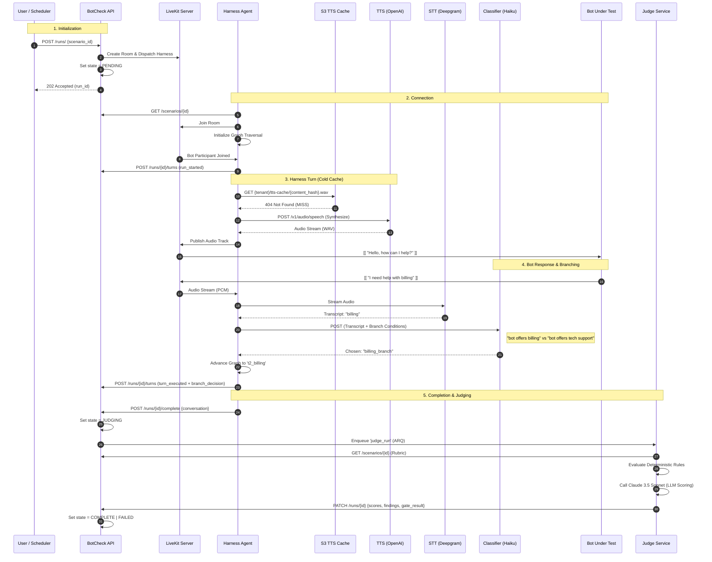

# Scenario Execution Flow (Cold Cache & Branching)

This diagram illustrates the lifecycle of a test run where the TTS cache is cold (requiring JIT synthesis) and the scenario contains adaptive branching logic.

### **Key Interaction Details:**

1.  **Orchestration (Steps 1-5):** The API acts as the control plane, setting up the environment and handing off execution to the Harness Agent via LiveKit Dispatches.
2.  **The Cache Miss (Steps 11-13):** Because the cache is cold, the Harness performs JIT (Just-In-Time) synthesis. This adds ~200-500ms of latency compared to a **Warm Cache** hit.
3.  **Adaptive Branching (Steps 18-21):** The Harness doesn't follow a fixed list. It uses a fast LLM (Claude Haiku) to classify the bot's response against the YAML `branching` conditions, allowing the test to "chase" the bot down different logic paths.
4.  **Fail-Closed Judging (Steps 23-28):** Completion is separate from scoring. The Harness provides the evidence, and the Judge Service performs the heavy lifting of multi-sample scoring and deterministic verification before the API issues the final `PASSED` or `BLOCKED` status.
