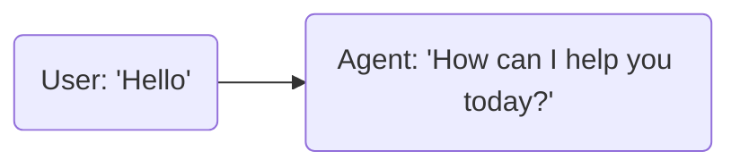
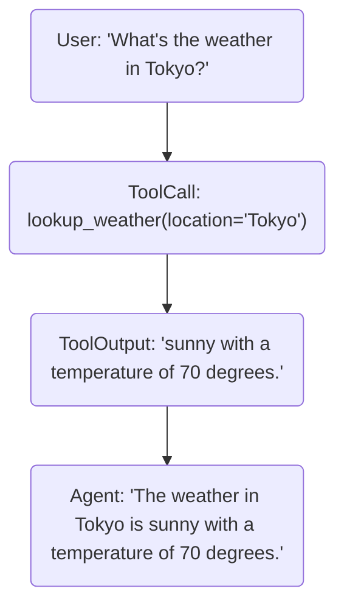

LiveKit docs › Get Started › Testing & evaluation

---

# Testing and evaluation

> Write tests to control and evaluate agent behavior.

## Overview

Writing effective tests and evaluations are a key part of developing a reliable and production-ready AI agent. LiveKit Agents includes helpers that work with testing frameworks like [pytest](https://docs.pytest.org/en/stable/) for Python or [Vitest](https://vitest.dev/) for Node.js, to write behavioral tests and evaluations alongside your existing unit and integration tests.

Use these tools to fine-tune your agent's behavior, work around tricky edge cases, and iterate on your agent's capabilities without breaking previously existing functionality.

## What to test

You should plan to test your agent's behavior in the following areas:

- **Expected behavior**: Does your agent respond with the right intent and tone for typical use cases?
- **Tool usage**: Are functions called with correct arguments and proper context?
- **Error handling**: How does your agent respond to invalid inputs or tool failures?
- **Grounding**: Does your agent stay factual and avoid hallucinating information?
- **Misuse resistance**: How does your agent handle intentional attempts to misuse or manipulate it?

> 💡 **Text-only testing**
> 
> The built-in testing helpers are designed to work with text input and output, using an LLM plugin or realtime model in text-only mode. This is the most cost-effective and intuitive way to write comprehensive tests of your agent's behavior.
> 
> For testing options that exercise the entire audio pipeline, see the [third party testing tools](#third-party-testing-tools) section at the end of this guide.

## Example test

Here is a simple behavioral test for the agent created in the [voice AI quickstart](https://docs.livekit.io/agents/start/voice-ai-quickstart.md). It ensures that the agent responds with a friendly greeting and offers assistance.

**Python**:

```python
from livekit.agents import AgentSession
from livekit.plugins import openai

from my_agent import Assistant

@pytest.mark.asyncio
async def test_assistant_greeting() -> None:
    # Use Responses API (recommended)
    async with (
        openai.responses.LLM(model="gpt-4o-mini") as llm,
        AgentSession(llm=llm) as session,
    ):
        await session.start(Assistant())

        result = await session.run(user_input="Hello")

        await result.expect.next_event().is_message(role="assistant").judge(
            llm, intent="Makes a friendly introduction and offers assistance."
        )

        result.expect.no_more_events()


```

---

**Node.js**:

```typescript
import { initializeLogger, voice } from '@livekit/agents';
import * as openai from '@livekit/agents-plugin-openai';
import { describe, it, beforeAll, afterAll } from 'vitest';
// Import your agent class
import { Agent } from './agent';

// Initialize logger to suppress CLI output
initializeLogger({ pretty: false, level: 'warn' });

const { AgentSession } = voice;

describe('Assistant', () => {
  let session: voice.AgentSession;
  let llm: openai.LLM;

  beforeAll(async () => {
    llm = new openai.LLM({ model: 'gpt-4o-mini' });
    session = new AgentSession({ llm });
    await session.start({ agent: new Agent() });
  });

  afterAll(async () => {
    await session?.close();
  });

  it('should greet and offer assistance', async () => {
    const result = await session.run({ userInput: 'Hello' }).wait();

    await result.expect
      .nextEvent()
      .isMessage({ role: 'assistant' })
      .judge(llm, {
        intent: 'Makes a friendly introduction and offers assistance.',
      });

    result.expect.noMoreEvents();
  });
});

```

## Writing tests

> 💡 **Testing frameworks**
> 
> This guide uses [pytest](https://docs.pytest.org/en/stable/) for Python and [Vitest](https://vitest.dev/) for Node.js, but is adaptable to other testing frameworks.

### Installation

**Python**:

You must install both the `pytest` and `pytest-asyncio` packages to write tests for your agent.

```shell
uv add pytest pytest-asyncio

```

---

**Node.js**:

You must install `vitest` to write tests for your agent.

```shell
pnpm add -D vitest

```

> ℹ️ **Suppress CLI output**
> 
> Always call `initializeLogger({ pretty: false, level: 'warn' })` at the top of your test files to suppress verbose CLI output.

### Test setup

Each test typically follows the same pattern:

**Python**:

```python
@pytest.mark.asyncio # Or your async testing framework of choice
async def test_your_agent() -> None:
    async with (
        # You must create an LLM instance for the `judge` method
        inference.LLM(model="openai/gpt-4.1-mini") as llm,

        # Create a session for the life of this test. 
        # LLM is not required - it will use the agent's LLM if you don't provide one here
        AgentSession(llm=llm) as session,
    ):
        # Start the agent in the session
        await session.start(Assistant())

        # Run a single conversation turn based on the given user input
        result = await session.run(user_input="Hello")

        # ...your assertions go here...

```

---

**Node.js**:

```typescript
import { initializeLogger, voice } from '@livekit/agents';
import * as openai from '@livekit/agents-plugin-openai';
import { describe, it, beforeAll, afterAll } from 'vitest';
// Import your agent class
import { Agent } from './agent';

// Initialize logger to suppress CLI output
initializeLogger({ pretty: false, level: 'warn' });

const { AgentSession } = voice;

describe('YourAgent', () => {
  let session: voice.AgentSession;
  let llm: openai.LLM;

  beforeAll(async () => {
    // You must create an LLM instance for the `judge` method
    llm = new openai.LLM({ model: 'gpt-4o-mini', temperature: 0 });

    // Create a session for the life of this test.
    // LLM is not required - it will use the agent's LLM if you don't provide one here
    session = new AgentSession({ llm });

    // Start the agent in the session
    await session.start({ agent: new Agent() });
  });

  afterAll(async () => {
    await session?.close();
  });

  it('should test your agent', async () => {
    // Run a single conversation turn based on the given user input
    const result = await session.run({ userInput: 'Hello' }).wait();

    // ...your assertions go here...
  });
});

```

### Result structure

The `run` method executes a single conversation turn and returns a `RunResult`, which contains each of the events that occurred during the turn, in order, and offers a fluent assertion API.

Simple turns where the agent responds with a single message and no tool calls can be straightforward, with only a single entry:



However, a more complex turn may contain tool calls, tool outputs, handoffs, and one or more messages.



To validate these multi-part turns, you can use either of the following approaches.

#### Sequential navigation

- Cursor through the events with `next_event()`.
- Validate individual events with `is_*` assertions such as `is_message()`.
- Use `no_more_events()` to assert that you have reached the end of the list and no more events remain.

For example, to validate that the agent responds with a friendly greeting, you can use the following code:

**Python**:

```python
result.expect.next_event().is_message(role="assistant")

```

---

**Node.js**:

```typescript
result.expect.nextEvent().isMessage({ role: 'assistant' });

```

###### Skipping events

You can also skip events without validation:

- Use `skip_next()` to skip one event, or pass a number to skip multiple events.
- Use `skip_next_event_if()` to skip events conditionally if it matches the given type (`"message"`, `"function_call"`, `"function_call_output"`, or `"agent_handoff"`), plus optional other arguments of the same format as the `is_*` assertions.
- Use `next_event()` with a type and other arguments in the same format as the `is_*` assertions to skip non-matching events implicitly.

Example:

**Python**:

```python

result.expect.skip_next() # skips one event
result.expect.skip_next(2) # skips two events
result.expect.skip_next_event_if(type="message", role="assistant") # Skips the next assistant message

result.expect.next_event(type="message", role="assistant") # Advances to the next assistant message, skipping anything else. If no matching event is found, an assertion error is raised.

```

---

**Node.js**:

```typescript
result.expect.skipNext(); // skips one event
result.expect.skipNext(2); // skips two events
result.expect.skipNextEventIf({ type: 'message', role: 'assistant' }); // Skips the next assistant message

result.expect.nextEvent({ type: 'message', role: 'assistant' }); // Advances to the next assistant message, skipping anything else. If no matching event is found, an assertion error is raised.

```

#### Indexed access

Access a specific event by index without advancing the cursor. You can use negative indices to access events from the end of the list. For example, `-1` for the last event.

**Python**:

```python
result.expect[0].is_message(role="assistant")

```

---

**Node.js**:

```typescript
result.expect.at(0).isMessage({ role: 'assistant' });

```

#### Search

Look for the presence of individual events in an order-agnostic way with the `contains_*` methods such as `contains_message()`. This can be combined with slices using the `[:]` operator to search within a range.

**Python**:

```python
result.expect.contains_message(role="assistant")
result.expect[0:2].contains_message(role="assistant")

```

---

**Node.js**:

```typescript
result.expect.containsMessage({ role: 'assistant' });
result.expect.range(0, 2).containsMessage({ role: 'assistant' });

```

### Assertions

The framework includes a number of assertion helpers to validate the content and types of events within each result.

#### Message assertions

Use `is_message()` and `contains_message()` to test individual messages. These methods accept an optional `role` argument to match the message role.

**Python**:

```python
result.expect.next_event().is_message(role="assistant")
result.expect[0:2].contains_message(role="assistant")

```

---

**Node.js**:

```typescript
result.expect.nextEvent().isMessage({ role: 'assistant' });
result.expect.range(0, 2).containsMessage({ role: 'assistant' });

```

Access additional properties with the `event()` method:

- **`event().item.content`** - Message content
- **`event().item.role`** - Message role

#### LLM-based judgment

Use `judge()` to perform a qualitative evaluation of the message content using your LLM of choice. Specify the intended content, structure, or style of the message as a string, and include an [LLM](https://docs.livekit.io/agents/models/llm.md) instance to evaluate it. The LLM receives the message string and the intent string, without surrounding context.

Here's an example:

**Python**:

```python
result = await session.run(user_input="Hello")

await (
    result.expect.next_event().is_message(role="assistant")
    .judge(
        llm, intent="Offers a friendly introduction and offer of assistance."
    )
)

```

---

**Node.js**:

```typescript
const result = await session.run({ userInput: 'Hello' }).wait();

await result.expect
  .nextEvent()
  .isMessage({ role: 'assistant' })
  .judge(llm, {
    intent: 'Offers a friendly introduction and offer of assistance.',
  });

```

The `llm` argument can be any LLM instance and does not need to be the same one used in the agent itself. Ensure you have setup the plugin correctly with the appropriate API keys and any other needed setup.

#### Tool call assertions

You can test three aspects of your agent's use of tools in these ways:

1. **Function calls**: Verify that the agent calls the correct tool with the correct arguments.
2. **Function call outputs**: Verify that the tool returns the expected output.
3. **Agent response**: Verify that the agent performs the appropriate next step based on the tool output.

This example tests all three aspects in order:

**Python**:

```python
result = await session.run(user_input="What's the weather in Tokyo?")

# Test that the agent's first conversation item is a function call
fnc_call = result.expect.next_event().is_function_call(name="lookup_weather", arguments={"location": "Tokyo"})

# Test that the tool returned the expected output to the agent
result.expect.next_event().is_function_call_output(output="sunny with a temperature of 70 degrees.")

# Test that the agent's response is appropriate based on the tool output
await (
    result.expect.next_event()
    .is_message(role="assistant")
    .judge(
        llm,
        intent="Informs the user that the weather in Tokyo is sunny with a temperature of 70 degrees.",
    )
)

# Verify the agent's turn is complete, with no additional messages or function calls
result.expect.no_more_events()

```

---

**Node.js**:

```typescript
const result = await session
  .run({ userInput: "What's the weather in Tokyo?" })
  .wait();

// Test that the agent's first conversation item is a function call
result.expect
  .nextEvent()
  .isFunctionCall({ name: 'getWeather', args: { location: 'Tokyo' } });

// Test that the tool returned the expected output to the agent
result.expect.nextEvent().isFunctionCallOutput();

// Test that the agent's response is appropriate based on the tool output
await result.expect
  .nextEvent()
  .isMessage({ role: 'assistant' })
  .judge(llm, {
    intent: 'Informs the user that the weather in Tokyo is sunny with a temperature of 70 degrees.',
  });

// Verify the agent's turn is complete, with no additional messages or function calls
result.expect.noMoreEvents();

```

Access individual properties with the `event()` method:

- **`is_function_call().event().item.name`** - Function name
- **`is_function_call().event().item.arguments`** - Function arguments
- **`is_function_call_output().event().item.output`** - Raw function output
- **`is_function_call_output().event().item.is_error`** - Whether the output is an error
- **`is_function_call_output().event().item.call_id`** - The function call ID

#### Agent handoff assertions

Use `is_agent_handoff()` and `contains_agent_handoff()` to test that the agent performs a [handoff](https://docs.livekit.io/agents/logic/workflows.md) to a new agent.

**Python**:

```python
# The next event must be an agent handoff to the specified agent
result.expect.next_event().is_agent_handoff(new_agent_type=MyAgent)

# A handoff must occur somewhere in the turn
result.expect.contains_agent_handoff(new_agent_type=MyAgent)

```

---

**Node.js**:

```typescript
// The next event must be an agent handoff to the specified agent
result.expect.nextEvent().isAgentHandoff({ newAgentType: MyAgent });

// A handoff must occur somewhere in the turn
result.expect.containsAgentHandoff({ newAgentType: MyAgent });

```

### Mocking tools

Available in:
- [ ] Node.js
- [x] Python

In many cases, you should mock your tools for testing. This is useful to easily test edge cases, such as errors or other unexpected behavior, or when the tool has a dependency on an external service that you don't need to test against.

> ℹ️ **Version requirement**
> 
> `mock_tools` requires LiveKit Agents 1.2.6 or later for Python.

**Python**:

Use the `mock_tools` helper in a `with` block to mock one or more tools for a specific Agent. For instance, to mock a tool to raise an error, use the following code:

```python
from livekit.agents import mock_tools

# Mock a tool error
with mock_tools(
    Assistant,
    {"lookup_weather": lambda: RuntimeError("Weather service is unavailable")},
):
    result = await session.run(user_input="What's the weather in Tokyo?")
    
    await result.expect.next_event(type="message").judge(
        llm, intent="Should inform the user that an error occurred while looking up the weather."
    )

```

If you need a more complex mock, pass a function instead of a lambda:

```python
def _mock_weather_tool(location: str) -> str:
    if location == "Tokyo":
        return "sunny with a temperature of 70 degrees."
    else:
        return "UNSUPPORTED_LOCATION"

# Mock a specific tool response
with mock_tools(Assistant, {"lookup_weather": _mock_weather_tool}):
    result = await session.run(user_input="What's the weather in Tokyo?")

    await result.expect.next_event(type="message").judge(
        llm,
        intent="Should indicate the weather in Tokyo is sunny with a temperature of 70 degrees.",
    )

    result = await session.run(user_input="What's the weather in Paris?")

    await result.expect.next_event(type="message").judge(
        llm,
        intent="Should indicate that weather lookups in Paris are not supported.",
    )

```

### Testing multiple turns

You can test multiple turns of a conversation by executing the `run` method multiple times. The conversation history builds automatically across turns.

**Python**:

```python
# First turn
result1 = await session.run(user_input="Hello")
await result1.expect.next_event().is_message(role="assistant").judge(
    llm, intent="Friendly greeting"
)

# Second turn builds on conversation history
result2 = await session.run(user_input="What's the weather like in Tokyo?")
result2.expect.next_event().is_function_call(name="lookup_weather")
result2.expect.next_event().is_function_call_output()
await result2.expect.next_event().is_message(role="assistant").judge(
    llm, intent="Provides weather information"
)

```

---

**Node.js**:

```typescript
// First turn
const result1 = await session.run({ userInput: 'Hello' }).wait();
await result1.expect
  .nextEvent()
  .isMessage({ role: 'assistant' })
  .judge(llm, {
    intent: 'Friendly greeting',
  });

// Second turn builds on conversation history
const result2 = await session.run({ userInput: "What's the weather like in Tokyo?" }).wait();
result2.expect.nextEvent().isFunctionCall({ name: 'getWeather' });
result2.expect.nextEvent().isFunctionCallOutput();
await result2.expect
  .nextEvent()
  .isMessage({ role: 'assistant' })
  .judge(llm, {
    intent: 'Provides weather information',
  });

```

### Loading conversation history

To load conversation history manually, use the `ChatContext` class just as in your agent code:

**Python**:

```python
from livekit.agents import ChatContext

agent = Assistant()
await session.start(agent)

chat_ctx = ChatContext()
chat_ctx.add_message(role="user", content="My name is Alice")
chat_ctx.add_message(role="assistant", content="Nice to meet you, Alice!")
await agent.update_chat_ctx(chat_ctx)

# Test that the agent remembers the context
result = await session.run(user_input="What's my name?")
await result.expect.next_event().is_message(role="assistant").judge(
    llm, intent="Should remember and mention the user's name is Alice"
)

```

---

**Node.js**:

```typescript
import { llm } from '@livekit/agents';

const { ChatContext } = llm;

const agent = new Assistant();
await session.start({ agent });

const chatCtx = new ChatContext();
chatCtx.addMessage({ role: 'user', content: 'My name is Alice' });
chatCtx.addMessage({ role: 'assistant', content: 'Nice to meet you, Alice!' });
await agent.updateChatCtx(chatCtx);

// Test that the agent remembers the context
const result = await session.run({ userInput: "What's my name?" }).wait();
await result.expect
  .nextEvent()
  .isMessage({ role: 'assistant' })
  .judge(llm, {
    intent: "Should remember and mention the user's name is Alice",
  });

```

## Verbose output

Environment variables can turn on detailed output for each agent execution.

**Python**:

The `LIVEKIT_EVALS_VERBOSE` environment variable turns on detailed output for each agent execution. To use it with pytest, you must also set the `-s` flag to disable pytest's automatic capture of stdout:

```shell
LIVEKIT_EVALS_VERBOSE=1 uv run pytest -s -o log_cli=true <your-test-file>

```

---

**Node.js**:

The `LIVEKIT_EVALS_VERBOSE` environment variable turns on detailed output for each agent execution.

```shell
LIVEKIT_EVALS_VERBOSE=1

```

Sample verbose output:

**Python**:

```shell
evals/test_agent.py::test_offers_assistance 
+ RunResult(
   user_input=`Hello`
   events:
     [0] ChatMessageEvent(item={'role': 'assistant', 'content': ['Hi there! How can I assist you today?']})
)
- Judgment succeeded for `Hi there! How can I assist...`: `The message provides a friendly greeting and explicitly offers assistance, fulfilling the intent.`
PASSED

```

---

**Node.js**:

```shell
stdout | conversation-history.test.ts > RunResult > should greet user by name

+ RunResult {
    userInput: "What's my name?"
    events: [
      [0] { type: "message", role: "assistant", content: "Your name is Alice.", interrupted: false }
    ]
  }

stdout | conversation-history.test.js > RunResult > should greet user by name
- Judgment succeeded for `Your name is Alice.`: `The message explicitly states the user's name is Alice, fulfilling the intent to remember and mention the user's name.`

```

## Integrating with CI

As the testing helpers work live against your LLM provider to test real agent behavior, you need to set up your CI system to include any necessary LLM API keys. Testing does not require LiveKit API keys as it does not make a LiveKit connection.

For GitHub Actions, see the guide on [using secrets in GitHub Actions](https://docs.github.com/en/actions/how-tos/security-for-github-actions/security-guides/using-secrets-in-github-actions).

> ⚠️ **Warning**
> 
> Never commit API keys to your repository. Use environment variables and CI secrets instead.

## Third-party testing tools

To perform end-to-end testing of deployed agents, including the audio pipeline, consider these third-party services:

- **[Bluejay](https://getbluejay.ai/)**: End-to-end testing for voice agents powered by real-world simulations.

- **[Cekura](https://www.cekura.ai/)**: Testing and monitoring for voice AI agents.

- **[Coval](https://www.coval.dev/)**: Manage your AI conversational agents. Simulation & evaluations for voice and chat agents.

- **[Hamming](https://hamming.ai/)**: At-scale testing & production monitoring for AI voice agents.

## Additional resources

These examples and resources provide more help with testing and evaluation.

- **[Agent starter project](https://github.com/livekit-examples/agent-starter-python)**: Starter project with a complete testing integration.

- **[Agent starter project (Node.js)](https://github.com/livekit-examples/agent-starter-node)**: Starter project with a complete testing integration.

- **[Testing framework API reference (Python)](https://docs.livekit.io/reference/python/livekit/agents/voice/run_result.html.md)**: API reference for the `RunResult` class.

- **[Testing framework API reference (Node.js)](https://docs.livekit.io/reference/agents-js/modules/agents.voice.testing.html.md)**: API reference for the `RunResult` class.

---

This document was rendered at 2026-02-23T12:49:56.957Z.
For the latest version of this document, see [https://docs.livekit.io/agents/start/testing.md](https://docs.livekit.io/agents/start/testing.md).

To explore all LiveKit documentation, see [llms.txt](https://docs.livekit.io/llms.txt).
